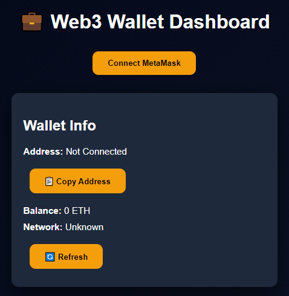
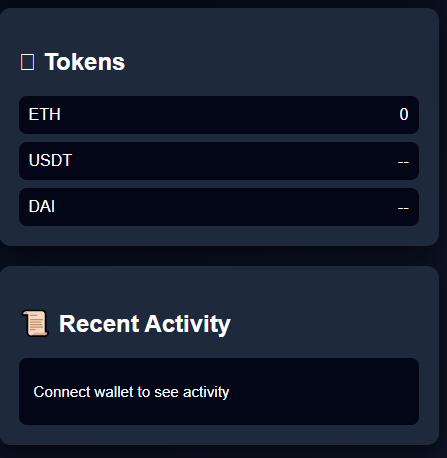

# 💼 Web3 Wallet Dashboard (React)

A modern Web3 dashboard built with React and Ethers.js that allows users to connect their wallet, view balances, and interact with blockchain data.

---

## 🚀 Features

* 🔗 Connect MetaMask wallet
* 💰 Display ETH balance
* 🌐 Detect network (Ethereum Mainnet, Testnets)
* 📋 Copy wallet address
* 🪙 Token section (UI ready)
* 📜 Activity section (UI ready)
* ⚛️ Built with React + Ethers.js

---

## 📸 Preview

<p align="center">
  
</p>

---

## 🛠 Tech Stack

* ⚛️ React
* 🔗 Ethers.js
* 🎨 CSS3
* 🌐 Web3

---

## 📁 Project Structure

```
web3-dashboard/
│── src/
│   ├── App.js
│   ├── App.css
│── public/
│── assets/
│   └── dashboard.png
│── package.json
│── README.md
```

---

## ▶️ Getting Started

### 1. Clone the repository

```
git clone https://github.com/your-username/web3-dashboard.git
cd web3-dashboard
```

### 2. Install dependencies

```
npm install
```

### 3. Install Ethers.js

```
npm install ethers@5
```

### 4. Run the app

```
npm start
```

---

## 🔗 How It Works

1. User clicks **Connect MetaMask**
2. Wallet connects using `window.ethereum`
3. App fetches:

   * Wallet address
   * ETH balance
   * Network info
4. Data is displayed in dashboard UI

---

## ⚠️ Important Notes

* Requires MetaMask browser extension
* Uses Ethers.js v5
* This is a frontend-only project (no backend)

---

## 🚧 Future Improvements

* 🪙 Show real ERC20 token balances
* 🖼 NFT gallery (ERC721 support)
* 📊 Portfolio value in USD
* 🌐 Multi-chain support
* 🔁 Transaction history
* 🔐 WalletConnect integration

---

## 📜 License

This project is open-source and free to use.

---

## 👨‍💻 Author

Built for learning and building real Web3 applications 🚀


